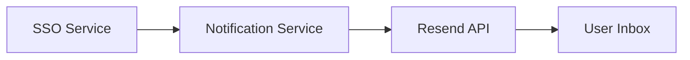

# Notification Service

Email service for OrderNest.

Default local URL: `http://localhost:8091`

## What it does
- Accepts email requests via REST API
- Sends email using Resend

## Quick start
```bash
./gradlew bootRun
```

## Required config
This service can load secrets from:
- `./etc/secrets/config.properties`

Example:
```properties
RESEND_API_KEY=re_xxxxxxxxx
NOTIFICATION_FROM_EMAIL=onboarding@resend.dev
NOTIFICATION_FROM_NAME=OrderNest Notification
```

## API + Swagger
- Send email: `POST /notifications/email`
- Swagger UI: `http://localhost:8091/swagger-ui/index.html`
- OpenAPI JSON: `http://localhost:8091/v3/api-docs`
- Health: `http://localhost:8091/actuator/health`

Sample request:
```json
{
  "to": "user@example.com",
  "subject": "Verify your email",
  "body": "<p>Click this link to verify your account.</p>"
}
```

## Postman
Import:
- `postman/notification-service.postman_collection.json`

## Mermaid design

